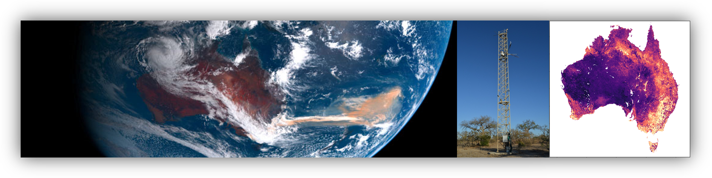

# AusEFlux: Empirical upscaling of terrestrial carbon fluxes over Australia using the OzFlux eddy covariance network

AusEFlux (**Aus**tralian **E**mpirical **Flux**es) is a high resolution (now 500m) gridded estimate of Gross Primary Productivity, Ecosystem Respiration, Net Ecosystem Exchange, and Evapotranspiration over the Australian continent for the period January 2003 to Present.  This new estimate of Australia’s terrestrial carbon cycle provides a benchmark for assessment against Land Surface Model simulations, and a means for monitoring of Australia’s terrestrial carbon cycle at an unprecedented high-resolution.

The notebooks in this repository describe the research methods used in the [EGU Biogeosciences publication](https://doi.org/10.5194/bg-20-4109-2023):

> Burton, C.A., Renzullo, L. J., Rifai, S. W., & Van Dijk, A. I., Empirical upscaling of OzFlux eddy covariance for high-resolution monitoring of terrestrial carbon uptake in Australia. Biogeosciences, 2023. 20(19): p. 4109-4134.

The notebooks are intended to be read/run in order of their labelling, i.e., 1 - 9. However, its unlikley if you clone this repo you could run the analysis as its dependent on a large python environment (not described here), and datasets that are stored on the NCI (where this analysis was run). I more reproducible, operational version of this workflow has been documented on the [AusEFlux repository](https://github.com/cbur24/AusEFlux)

<ins>**Important Update (1/3/2025)**<ins>

Version 2.0 of AusEFlux has just been released (as of March 2025) and was created to operationalise the research datasets. In order to operationalise these datasets, changes to the input datasets were required to align the data sources with datasets that are regularly and reliably updated, along with general improvements. The datasets provided on Zenodo (link below and in the description of this repo) have been reprojected to 5 km resolution to facilitate easier uploading and sharing, but full resolution datasets (both v1.1 and v2.0) can be accessed freely through [NCI's THREDDS portal](https://thredds.nci.org.au/thredds/catalog/ub8/au/AusEFlux/catalog.html).

Two Jupyter Notebooks have been created (one for GPP and one for NEE) that demonstrate the differences between the research datasets (v1.1) and the operational datasets (v2.0), including showing the differences in specifications and inputs.  You can view/download these notebooks using the links below:

* [GPP comparison between versions](https://nbviewer.org/github/cbur24/AusEFlux/blob/master/notebooks/analysis/Compare_AusEFlux_versions_GPP.ipynb)
* [NEE comparisons between versions](https://nbviewer.org/github/cbur24/AusEFlux/blob/master/notebooks/analysis/Compare_AusEFlux_versions_NEE.ipynb)

**Version Guide**
* _v1.1:_ This version of the datasets are those used to inform the EGU Publication linked above. Its time range is 2003-July 2022, and its spatial resolution is 5 km on Zenodo, but the 1 km resolution datasets can be accessed through [NCI's THREDDS portal](https://thredds.nci.org.au/thredds/catalog/ub8/au/AusEFlux/v1/catalog.html).
* _v2.0:_ This is the operational version of the dataset, its includes several improvements over version 1.1. Its time-range is 2003-2024 (and will be updated annually), and its spatial resolution is 500m.  A 5 km reprojected version of the dataset is included on Zenodo, but the 500 metre datasets can be accessed through [NCI's THREDDS portal](https://thredds.nci.org.au/thredds/catalog/ub8/au/AusEFlux/v2/catalog.html).

***

Coarser resolution outputs of this analysis, stored as netcdfs, can be accessed at Zenodo: https://doi.org/10.5281/zenodo.7947265. 
If using the datasets, please cite using:

> Burton, C., Renzullo, L., Rifai, S., Van Dijk, A., 2023. AusEFlux: Empirical upscaling of OzFlux eddy covariance flux tower data over Australia. https://doi.org/10.5281/zenodo.7947265

**License:** The code in this repository is licensed under the [Apache License, Version 2.0](https://www.apache.org/licenses/LICENSE-2.0)
